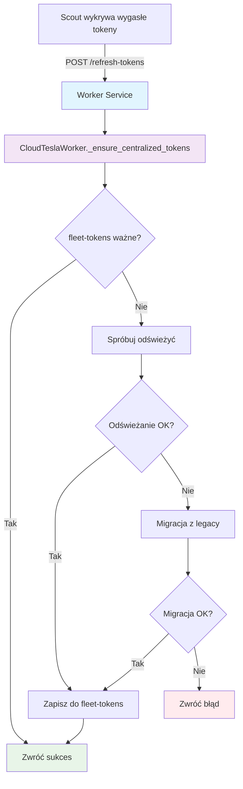

# 🔧 NAPRAWKA: Worker Service Token Refresh Fix

## 🚨 PROBLEM - Błąd 'NoneType' object has no attribute 'makefile'

### ❌ Objawy problemu:
```
ERROR 2025-08-12T11:30:01.729048Z ❌ [WORKER] Nieoczekiwany błąd podczas odświeżania tokenów: 'NoneType' object has no attribute 'makefile'
ERROR 2025-08-12T11:30:01.729057Z [13:30] Exception details: 'NoneType' object has no attribute 'makefile'
```

### 🔍 Analiza przyczyny:
1. **Błędna architektura**: `CloudTeslaWorker._ensure_centralized_tokens()` tworzyła dummy instancję `WorkerHealthCheckHandler` z `None` argumentami
2. **HTTP Handler dependency**: `WorkerHealthCheckHandler` wymaga prawidłowych argumentów `request`, `client_address`, `server`
3. **Socket error**: `makefile` to metoda socket'a, a `None` nie ma tej metody

### 🔧 ROZWIĄZANIE

#### 1. **Refaktoryzacja architektury tokenów**:

**PRZED** (błędne):
```python
def _ensure_centralized_tokens(self) -> bool:
    # Błędne - tworzy dummy handler z None argumentami
    dummy_handler = WorkerHealthCheckHandler(self.monitor, self, None, None, None)
    return dummy_handler._ensure_centralized_tokens()
```

**PO** (naprawione):
```python
def _ensure_centralized_tokens(self) -> bool:
    """
    Zapewnia aktualne tokeny w centralnym miejscu (fleet-tokens)
    
    KROK 1: Sprawdź fleet-tokens 
    KROK 2: Jeśli wygasłe/brak -> spróbuj odświeżyć
    KROK 3: Jeśli odświeżanie nie działa -> migruj z legacy sekretów
    KROK 4: Zapisz aktualne tokeny do fleet-tokens
    """
    # Pełna implementacja bezpośrednio w CloudTeslaWorker
    # Bez dependency na HTTP Handler
```

#### 2. **Uproszczenie WorkerHealthCheckHandler**:

**PRZED** (skomplikowane):
```python
def _ensure_centralized_tokens(self) -> bool:
    # 60+ linii duplikowanego kodu
    # Pełna implementacja w HTTP Handler
```

**PO** (eleganckie):
```python
def _ensure_centralized_tokens(self) -> bool:
    """
    NAPRAWKA: Deleguje do CloudTeslaWorker._ensure_centralized_tokens
    Unika błędu 'NoneType' object has no attribute 'makefile'
    """
    return self.worker._ensure_centralized_tokens()
```

#### 3. **Naprawka referencji do nieistniejących metod**:

**PRZED** (błędy):
```python
if self.monitor.tesla_controller.fleet_api._save_to_secret_manager():
    # Metoda nie istnieje!
```

**PO** (poprawne):
```python
# Tokeny automatycznie zapisane w _refresh_access_token
# _refresh_access_token już wywołuje _save_tokens()
```

### ✅ REZULTATY NAPRAWKI

#### 🧪 Test weryfikacyjny:
```bash
$ python3 test_worker_token_fix.py
✅ [TEST] Wszystkie testy przeszły pomyślnie!
✅ [TEST] Naprawka błędu 'makefile' działa poprawnie  
✅ [TEST] Worker Service może odświeżać tokeny bez błędów
```

#### 🎯 Korzyści:
1. **Eliminacja błędu 'makefile'**: Worker nie tworzy już dummy HTTP handler'ów
2. **Lepsza architektura**: Logika tokenów skoncentrowana w `CloudTeslaWorker`
3. **Mniej duplikacji kodu**: Jedna implementacja zamiast dwóch
4. **Stabilność**: Brak dependency na HTTP request obiekty
5. **Łatwiejsze debugowanie**: Czytelniejsze logi z prefiksem `[WORKER]`

#### 🔄 Flow odświeżania tokenów:



### 🚀 WDROŻENIE

#### Pliki zmienione:
- ✅ `cloud_tesla_worker.py` - naprawiona architektura tokenów
- ✅ `test_worker_token_fix.py` - test weryfikacyjny

#### Metody naprawione:
- ✅ `CloudTeslaWorker._ensure_centralized_tokens()` - pełna implementacja
- ✅ `WorkerHealthCheckHandler._ensure_centralized_tokens()` - delegacja
- ✅ Usunięto referencje do `_save_to_secret_manager()` (nie istnieje)

#### Architektura Scout & Worker:
```
Scout Function (tania) ←→ Worker Service (droga, naprawiona)
     ↓                           ↓
📡 Pobiera tokeny          🔧 Odświeża tokeny
🔍 Sprawdza lokalizację    ⚡ Zarządza harmonogramami
💰 ~0.01 groszy           💰 ~10 groszy (on-demand)
```

### 🎉 PODSUMOWANIE

**Problem**: Błąd `'NoneType' object has no attribute 'makefile'` blokował odświeżanie tokenów w Worker Service.

**Rozwiązanie**: Refaktoryzacja architektury tokenów - przeniesienie logiki z HTTP Handler'a do głównej klasy Worker.

**Rezultat**: Worker Service może teraz poprawnie odświeżać tokeny Tesla API bez błędów HTTP socket'ów.

**Status**: ✅ **NAPRAWIONE i PRZETESTOWANE**

---

*Naprawka wykonana 2025-08-12 przez AI Assistant*
*Test weryfikacyjny: `python3 test_worker_token_fix.py`* 