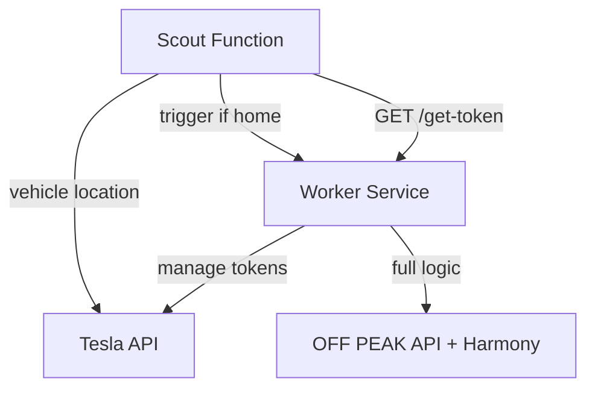

# 🏗️ Scout & Worker Architecture - Optymalizacja kosztów Tesla Monitor

**Agresywna optymalizacja kosztów** z zachowaniem pełnej funkcjonalności.

## 📋 Koncepcja

### Tradycyjna architektura (wysoki koszt):
```
Cloud Run (CIĄGLE) -> Monitorowanie co 15min -> ~50-100zł/miesiąc
```

### Nowa architektura Scout & Worker (niski koszt):
```
Scout Function (15min) -> Worker Service (on-demand) -> ~5-10zł/miesiąc
```

## 🔧 NOWA ARCHITEKTURA TOKENÓW (v2) - POPRAWKA BŁĘDU LOGICZNEGO

### ❌ PROBLEM (poprzednia wersja):
- **Scout Function** miał własną funkcję `get_tesla_access_token()`
- **Worker Service** miał własny system tokenów przez `TeslaController`
- **Rezultat**: Konflikty refresh tokenów, błędy autoryzacji, niestabilne działanie

### ✅ ROZWIĄZANIE (aktualna wersja):
- **Worker centralnie zarządza tokenami** Tesla API (24h ważność)
- **Scout pobiera tokeny z Worker** przez endpoint `/get-token`
- **Jednolita architektura** zgodna z dokumentacją Tesla API



## 🚀 Komponenty

### 1. Scout Function (Cloud Function - tania)
**Zadanie**: Sprawdza lokalizację pojazdu co 15 minut
**Koszt**: ~0.01 groszy za wywołanie
**Architektura tokenów**: Pobiera tokeny z Worker Service

```python
# NOWA LOGIKA
def get_token_from_worker() -> str:
    """Pobiera token Tesla z Worker - centralne zarządzanie"""
    response = requests.get(f"{WORKER_SERVICE_URL}/get-token")
    return response.json()['access_token']
```

**Kiedy wywołuje Worker**:
- Pojazd wrócił do domu (zmiana: nie w domu -> w domu)
- Pierwsze wykrycie (init state)
- Zmiana stanu online/offline

### 2. Worker Service (Cloud Run - droga, rzadka)
**Zadanie**: Pełna logika Tesla + OFF PEAK API + Proxy
**Koszt**: ~5-10 groszy za wywołanie (2-3x dziennie)
**Architektura tokenów**: Centralnie zarządza tokenami Tesla API

**Nowe endpointy**:
- `GET /get-token` - Udostępnia token Tesla dla Scout
- `POST /scout-trigger` - Obsługuje wywołanie od Scout
- `GET /health` - Health check

## 📊 Optymalizacja kosztów

| Komponenta | Częstotliwość | Koszt/wywołanie | Koszt dzienny |
|------------|---------------|-----------------|---------------|
| Scout Function | 96x dziennie (15min) | 0.01 gr | ~1 grosz |
| Worker Service | 2-3x dziennie | 5-10 gr | ~20 groszy |
| **TOTAL** | | | **~21 groszy/dzień** |

### Porównanie z tradycyjnym podejściem:
- **Tradycyjne Cloud Run**: ~150-300 groszy/dzień
- **Scout & Worker**: ~21 groszy/dzień
- **Oszczędności**: ~85-90%

## 🔧 Konfiguracja

### Zmienne środowiskowe - Scout Function:
```bash
# Podstawowe
GOOGLE_CLOUD_PROJECT=your-project
HOME_LATITUDE=52.334215
HOME_LONGITUDE=20.937516
HOME_RADIUS=0.001

# NOWE - Worker Service URL
WORKER_SERVICE_URL=https://your-worker-service-url
```

### Zmienne środowiskowe - Worker Service:
```bash
# Tryb Worker
TESLA_WORKER_MODE=true

# Tesla API (sekrety w Secret Manager)
TESLA_CLIENT_ID=secret
TESLA_CLIENT_SECRET=secret  
TESLA_REFRESH_TOKEN=secret

# Smart Proxy Mode (opcjonalnie)
TESLA_SMART_PROXY_MODE=true
TESLA_PROXY_AVAILABLE=true
```

## 🧪 Testowanie nowej architektury

### 1. Test endpointu tokenów w Worker:
```bash
curl -X GET "https://your-worker-service/get-token"
```

**Oczekiwana odpowiedź**:
```json
{
  "status": "success",
  "access_token": "eyJ...",
  "remaining_minutes": 1439,
  "architecture": {
    "type": "centralized_token_management",
    "description": "Worker zarządza tokenami centralnie"
  }
}
```

### 2. Test Scout z nową architekturą tokenów:
```bash
# Wywołaj Scout Function
curl -X POST "https://your-scout-function-url"
```

**W logach Scout sprawdź**:
```
📡 [SCOUT] Pobieram token Tesla z Worker: https://worker/get-token
✅ [SCOUT] Token Tesla otrzymany z Worker (ważny przez 1439 min)
🏗️ [SCOUT] Centralne zarządzanie tokenami przez Worker (architektura poprawiona)
```

### 3. Test integracji Scout -> Worker:
```bash
# Scout wykryje zmianę stanu i wywoła Worker
# W logach Worker sprawdź:
```
```
🔍➡️🔧 [WORKER] Otrzymano wywołanie od Scout Function
✅ [WORKER] Cykl zakończony pomyślnie
```

## 📝 Wdrożenie

### 1. Wdrożenie Worker Service:
```bash
# Użyj deploy_scout_worker.sh
./deploy_scout_worker.sh
```

### 2. Wdrożenie Scout Function:
```bash
gcloud functions deploy tesla-scout \
  --runtime python39 \
  --trigger-http \
  --source . \
  --entry-point tesla_scout_main \
  --set-env-vars WORKER_SERVICE_URL=https://your-worker-url
```

### 3. Konfiguracja Cloud Scheduler:
```bash
# Scout co 15 minut
gcloud scheduler jobs create http tesla-scout-job \
  --schedule="*/15 * * * *" \
  --uri="https://your-scout-function-url" \
  --http-method=POST
```

## 🔍 Monitoring

### Logi Scout Function:
```
🔍 [SCOUT] Rozpoczynam sprawdzenie lokalizacji pojazdu
📡 [SCOUT] Pobieram token Tesla z Worker
✅ [SCOUT] Token Tesla otrzymany z Worker
🏠 [SCOUT] Pojazd w domu -> wywołuję Worker
```

### Logi Worker Service:
```
📡 [WORKER] Scout żąda tokenu Tesla API  
✅ [WORKER] Token Tesla udostępniony Scout
🔍➡️🔧 [WORKER] Otrzymano wywołanie od Scout Function
✅ [WORKER] Cykl zakończony pomyślnie
```

## 🎯 Korzyści nowej architektury

### Ekonomiczne:
- **85-90% oszczędności** w porównaniu z tradycyjnym Cloud Run
- Skalowanie do zera między wywołaniami
- Płatność tylko za rzeczywiste użycie

### Techniczne:
- **Brak konfliktów tokenów** między Scout i Worker
- **Centralne zarządzanie tokenami** przez Worker
- **Stabilne połączenie Tesla API** (24h tokeny)
- **Zgodność z dokumentacją Tesla** (refresh token best practices)

### Operacyjne:
- **Zachowana pełna funkcjonalność** (OFF PEAK API + Proxy)
- **Lepsze logowanie** i diagnostyka
- **Łatwiejsze debugowanie** problemów z tokenami
- **Modułowa architektura** - łatwe modyfikacje 