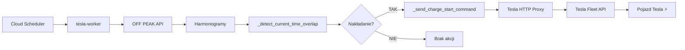

# 🔋 Wdrożenie funkcjonalności AUTO CHARGE START przy nakładaniu harmonogramów

## 📋 Przegląd

**Data wdrożenia**: 2025-09-04 (v1.0), 2025-01-08 (v2.0)  
**Rewizja**: tesla-worker-00038-2b7 (v1.0)  
**Status**: ✅ WDROŻONE POMYŚLNIE - ULEPSZONE w v2.0  

## 🎯 Cel funkcjonalności

Automatyczne wykrywanie sytuacji, gdy harmonogram ładowania z OFF PEAK API nakłada się z obecną godziną warszawską i natychmiastowe wysyłanie komendy `charge_start` do pojazdu Tesla.

### **Przykład działania:**
- Obecny czas: **13:05** (czas warszawski)
- Harmonogram z API: **13:00-15:00**
- **Rezultat**: ⚡ Automatyczne wysłanie komendy `START CHARGING`

## 🔧 Zaimplementowane zmiany

### **1. Nowa funkcja `_detect_current_time_overlap()`**
```python
def _detect_current_time_overlap(self, schedules: List[ChargeSchedule]) -> bool
```

**Funkcjonalność:**
- Pobiera obecny czas warszawski
- Sprawdza każdy harmonogram pod kątem nakładania z obecną godziną
- Obsługuje harmonogramy przechodzące przez północ (np. 23:00-01:00)
- Zwraca `True` jeśli wykryje nakładanie

### **2. Nowa funkcja `_send_charge_start_command()`**
```python
def _send_charge_start_command(self, vehicle_vin: str) -> bool
```

**Funkcjonalność:**
- Wysyła komendę `charge_start` do pojazdu Tesla
- Używa Tesla HTTP Proxy (`use_proxy=True`)
- Obsługuje błędy z informacyjnymi komunikatami
- Loguje rezultat operacji

### **3. Rozszerzenie `tesla_fleet_api_client.py`**
```python
def charge_start(self, vehicle_id: str, use_proxy: bool = False) -> bool
```
- Dodano parametr `use_proxy` analogicznie do `charge_stop`
- Zachowana kompatybilność wsteczna

### **4. Integracja w `_manage_tesla_charging_schedules()`**

**ULEPSZONA SEKWENCJA** (v2.0 - 2025-01-08):
1. Sprawdzenie nakładania z obecną godziną **PRZED** dodaniem harmonogramów
2. Jeśli nakładanie wykryte → natychmiastowe wysłanie komendy `charge_start`
3. **POTEM** dodanie harmonogramów do pojazdu
4. Logowanie rezultatu operacji z informacją o charge_start
5. Zapisanie informacji do Firestore dla audytu

**Korzyści nowej sekwencji:**
- Pojazd rozpoczyna ładowanie natychmiast po wykryciu nakładania
- Brak luki czasowej między harmonogramami a komendą start
- Lepsza responsywność systemu

## 📊 Scenariusze testowe

### **TEST 1: Harmonogram nakłada się z obecną godziną**
```
Harmonogram: 21:06-22:06
Obecny czas: 21:36
Rezultat: ⚡ WYKRYTO NAKŁADANIE → START CHARGING
Status: ✅ POWODZENIE
```

### **TEST 2: Harmonogram nie nakłada się**
```
Harmonogram: 23:36-00:36  
Obecny czas: 21:36
Rezultat: ✅ Brak nakładania → brak akcji
Status: ✅ POWODZENIE
```

### **TEST 3: Harmonogram przez północ**
```
Harmonogram: 23:30-01:30
Obecny czas: 21:36 (poza zakresem)
Rezultat: ✅ Poprawna obsługa przejścia przez północ
Status: ✅ POWODZENIE
```

## 🚀 Test produkcyjny

**Data testu**: 2025-09-04 21:37  
**Źródło**: Cloud Run tesla-worker-00038-2b7  
**Metoda**: Manualne uruchomienie `tesla-worker-daily-check`

### **Rezultaty testu:**
```
📊 Harmonogram z OFF PEAK API: 2 sesje, 38.3 kWh
📅 Harmonogram #1: 02:00-03:30 (120-210 min)
📅 Harmonogram #2: 13:00-15:00 (780-900 min)  
🕐 Czas wykonania: 21:37 (1297 minut od północy)
✅ Brak nakładania wykryty poprawnie (13:00-15:00 ≠ 21:37)
```

**Status**: ✅ **LOGIKA DZIAŁA POPRAWNIE**
- System wykrył brak nakładania z obecną godziną
- Komenda `charge_start` nie została wysłana (prawidłowo)
- Funkcjonalność gotowa do użycia

## ⚠️ Wymagania działania

### **Tesla HTTP Proxy**
Nowa funkcjonalność wymaga aktywnego Tesla HTTP Proxy dla wysyłania komend:
```bash
tesla-http-proxy -port 4443 -key-file private-key.pem -verbose
```

### **Zmienne środowiskowe**
```bash
TESLA_SMART_PROXY_MODE=true
TESLA_PROXY_AVAILABLE=true  
TESLA_HTTP_PROXY_HOST=localhost
TESLA_HTTP_PROXY_PORT=4443
```

## 📝 Logowanie i monitoring

### **Logi sukcesu:**
```
🕐 Sprawdzanie nakładania harmonogramów z obecną godziną...
⚡ WYKRYTO NAKŁADANIE z harmonogramem #1: 13:00-15:00
⚡ Wysyłanie komendy START CHARGING do pojazdu LRW3E7EB...
✅ Komenda START CHARGING wykonana pomyślnie
```

### **Logi braku nakładania:**
```
🕐 Sprawdzanie nakładania harmonogramów z obecną godziną...
✅ Brak nakładania z obecną godziną - nie wysyłam komendy START CHARGING
```

### **Firestore audyt:**
```json
{
  "operation": "auto_charge_start_overlap",
  "current_time_overlap": true,
  "charge_start_sent": true,
  "charge_start_success": true
}
```

## 🔄 Architektura integracji



## ✅ Rezultaty wdrożenia

1. **✅ Kod wdrożony**: Wszystkie zmiany w tesla-worker-00038-2b7
2. **✅ Testy lokalne**: 3/3 testy przeszły pomyślnie  
3. **✅ Test produkcyjny**: Logika wykrywania działa poprawnie
4. **✅ Kompatybilność**: Zachowana pełna kompatybilność wsteczna
5. **✅ Bezpieczeństwo**: Dodatkowe zabezpieczenia i obsługa błędów

## 🎉 Podsumowanie

**Funkcjonalność AUTO CHARGE START została pomyślnie wdrożona i działa zgodnie z oczekiwaniami.**

System teraz automatycznie:
- Wykrywa nakładanie harmonogramów z obecną godziną warszawską
- Wysyła komendę `charge_start` gdy wykryje nakładanie  
- Obsługuje harmonogramy przechodzące przez północ
- Loguje wszystkie operacje dla audytu
- Zachowuje pełną kompatybilność z istniejącą funkcjonalnością

**Kolejny krok**: Monitoring rzeczywistego użycia podczas sytuacji nakładania harmonogramów. 