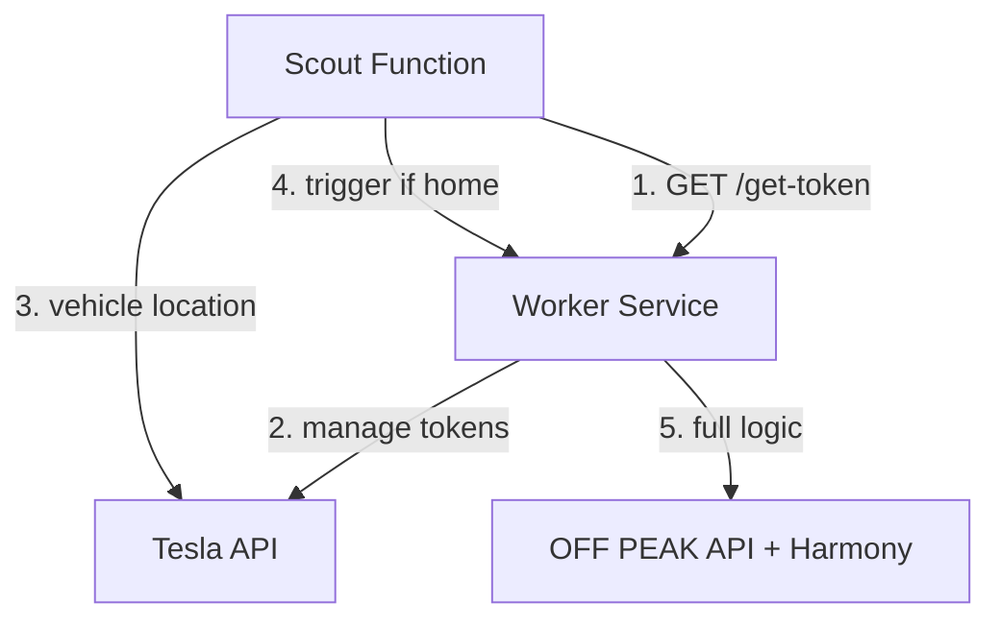

# 🏗️ Scout & Worker Architecture - Kompletny Przewodnik

**Agresywna optymalizacja kosztów Tesla Monitor** z zachowaniem pełnej funkcjonalności.

## 📋 Koncepcja

### Tradycyjna architektura (wysoki koszt):
```
Cloud Run (CIĄGLE) -> Monitorowanie co 15min -> ~50-100zł/miesiąc
```

### Nowa architektura Scout & Worker (niski koszt):
```
Scout Function (15min) -> Worker Service (on-demand) -> ~5-10zł/miesiąc
```

**Oszczędności: 85-90%**

---

## 🔧 ARCHITEKTURA TOKENÓW v3.1 - Centralne Zarządzanie

### ❌ PROBLEM (poprzednia wersja):
- **Scout Function** miał własną funkcję `get_tesla_access_token()`
- **Worker Service** miał własny system tokenów przez `TeslaController`
- **Rezultat**: Konflikty refresh tokenów, błędy autoryzacji, niestabilne działanie

### ✅ ROZWIĄZANIE (aktualna wersja v3.1):
- **Worker centralnie zarządza tokenami** Tesla API (24h ważność)
- **Scout pobiera tokeny z Worker** przez endpoint `/get-token`
- **Automatyczne odświeżanie** wygasłych tokenów przez fallback mechanism
- **Jednolita architektura** zgodna z dokumentacją Tesla API



### 🔄 Mechanizm Fallback (v3.1):

**Normalny przepływ (95% przypadków)**:
```
Scout → Secret Manager → Tesla API
```

**Przepływ awaryjny (5% przypadków - wygasłe tokeny)**:
```
Scout → wykrywa wygasłe tokeny → Worker /refresh-tokens → 
Worker odświeża tokeny → Scout pobiera świeże tokeny → Tesla API
```

---

## 🚀 Komponenty

### 1. Scout Function (Cloud Function - tania)
**Zadanie**: Sprawdza lokalizację pojazdu co 15 minut  
**Koszt**: ~0.01 groszy za wywołanie  
**Architektura tokenów**: Pobiera tokeny z Worker Service z fallback mechanism

```python
# ARCHITEKTURA v3.1 - Smart Token Management
def get_tesla_access_token_smart() -> Optional[str]:
    """
    Pobiera token Tesla z fallback mechanism:
    1. Próbuje Secret Manager bezpośrednio (niski koszt)
    2. Jeśli tokeny wygasłe -> wywołuje Worker do odświeżenia
    3. Pobiera świeże tokeny po odświeżeniu przez Worker
    """
    
    # Sprawdź cache i Secret Manager
    token = get_token_from_secret_manager()
    
    if token_expired(token):
        # FALLBACK: Wywołaj Worker do odświeżenia
        refresh_result = trigger_worker_refresh_tokens("Token wygasł")
        
        if refresh_result["success"]:
            # Pobierz świeże tokeny po odświeżeniu
            token = retry_get_token_from_secret_manager()
    
    return token
```

**Kiedy wywołuje Worker**:
- Pojazd wrócił do domu (zmiana: nie w domu -> w domu)
- Pierwsze wykrycie (init state)
- Zmiana stanu online/offline

### 2. Worker Service (Cloud Run - droga, rzadka)
**Zadanie**: Pełna logika Tesla + OFF PEAK API + Proxy  
**Koszt**: ~5-10 groszy za wywołanie (2-3x dziennie)  
**Architektura tokenów**: Centralnie zarządza tokenami Tesla API

**Endpointy**:
- `GET /get-token` - Udostępnia token Tesla dla Scout
- `POST /refresh-tokens` - Odświeża wygasłe tokeny (fallback mechanism)
- `POST /scout-trigger` - Obsługuje wywołanie od Scout
- `GET /health` - Health check

---

## 📊 Optymalizacja kosztów

| Komponenta | Częstotliwość | Koszt/wywołanie | Koszt dzienny |
|------------|---------------|-----------------|---------------|
| Scout Function | 96x dziennie (15min) | 0.01 gr | ~1 grosz |
| Worker Service | 2-3x dziennie | 5-10 gr | ~20 groszy |
| **TOTAL** | | | **~21 groszy/dzień** |

### Porównanie z tradycyjnym podejściem:
- **Tradycyjne Cloud Run**: ~150-300 groszy/dzień
- **Scout & Worker**: ~21 groszy/dzień
- **Oszczędności**: ~85-90%

---

## 🛡️ Mechanizmy Ochronne v3.1

### 1. Rate Limiting (ochrona przed endless loop)
```python
# Maksymalnie 1 próba odświeżenia na minutę
if _last_refresh_attempt and (now - _last_refresh_attempt).seconds < 60:
    return {"success": False, "message": "Rate limit"}
```

### 2. Timeout Protection  
```python
# 45s timeout dla Worker (potrzebuje czasu na odświeżenie)
response = requests.post(..., timeout=45)
```

### 3. Connection Error Handling
```python
try:
    response = requests.post(...)
except requests.exceptions.ConnectionError:
    return {"success": False, "error": "Worker unavailable"}
```

### 4. Cache Clearing po odświeżeniu
```python
def clear_cache(self):
    # Usuń cache żeby wymusić świeże pobranie
    if os.path.exists(self.cache_file):
        os.remove(self.cache_file)
```

---

## 🔧 Konfiguracja

### Zmienne środowiskowe - Scout Function:
```bash
# Podstawowe
GOOGLE_CLOUD_PROJECT=your-project
HOME_LATITUDE=52.334215
HOME_LONGITUDE=20.937516
HOME_RADIUS=0.001

# Worker Service URL (wymagane dla architektury v3.1)
WORKER_SERVICE_URL=https://your-worker-service-url
```

### Zmienne środowiskowe - Worker Service:
```bash
# Tryb Worker
TESLA_WORKER_MODE=true

# Tesla API (sekrety w Secret Manager)
TESLA_CLIENT_ID=secret
TESLA_CLIENT_SECRET=secret  
TESLA_REFRESH_TOKEN=secret

# Smart Proxy Mode (opcjonalnie)
TESLA_SMART_PROXY_MODE=true
TESLA_PROXY_AVAILABLE=true
```

---

## 🧪 Testowanie Architektury v3.1

### 1. Test endpointu tokenów w Worker:
```bash
curl -X GET "https://your-worker-service/get-token"
```

**Oczekiwana odpowiedź**:
```json
{
  "status": "success",
  "access_token": "eyJ...",
  "remaining_minutes": 1439,
  "architecture": {
    "type": "centralized_token_management",
    "description": "Worker zarządza tokenami centralnie"
  }
}
```

### 2. Test fallback mechanism:
```bash
# Uruchom test weryfikacyjny
python3 test_token_refresh_fallback.py

# Oczekiwany wynik:
# ✅ PASS Worker Endpoint
# ✅ PASS Scout Fallback  
# ✅ PASS Rate Limiting
# ✅ PASS Cache Clearing
# 🎉 WSZYSTKIE TESTY PRZESZŁY
```

### 3. Test Scout z architekturą v3.1:
```bash
# Wywołaj Scout Function
curl -X POST "https://your-scout-function-url"
```

**W logach Scout sprawdź**:
```
📡 [SCOUT] Pobieram token Tesla z Worker lub Secret Manager
✅ [SCOUT] Token Tesla otrzymany (ważny przez 1439 min)
🏗️ [SCOUT] Centralne zarządzanie tokenami przez Worker (architektura v3.1)
```

**W przypadku wygasłych tokenów**:
```
⚠️ [SCOUT] Token in fleet-tokens expired or expiring in <5 min  
🔄 [SCOUT] Wywołuję Worker do odświeżenia tokenów
✅ [SCOUT] Worker potwierdził odświeżenie - pobieram świeże tokeny
✅ [SCOUT] Pomyślnie pobrano świeże tokeny po odświeżeniu przez Worker
```

---

## 🚀 Wdrożenie

### 1. Wdrożenie Worker Service z architekturą v3.1:
```bash
# Użyj deploy_scout_worker.sh
./deploy_scout_worker.sh
```

### 2. Wdrożenie Scout Function z fallback mechanism:
```bash
gcloud functions deploy tesla-scout \
  --runtime python39 \
  --source=scout_function_deploy \
  --entry-point tesla_scout_main \
  --set-env-vars="WORKER_SERVICE_URL=https://your-worker-url"
```

### 3. Konfiguracja Cloud Scheduler:
```bash
# Scout co 15 minut
gcloud scheduler jobs create http tesla-scout-job \
  --schedule="*/15 * * * *" \
  --uri="https://your-scout-function-url" \
  --http-method=POST

# Worker failsafe (nocne wybudzenie)
gcloud scheduler jobs create http tesla-worker-daily-check \
  --schedule="0 0 * * *" \
  --time-zone="Europe/Warsaw" \
  --uri="https://your-worker-url/run-cycle" \
  --http-method=POST
```

---

## 🔍 Monitoring

### Logi Scout Function (normalne działanie):
```
🔍 [SCOUT] Rozpoczynam sprawdzenie lokalizacji pojazdu
📡 [SCOUT] Pobieram token Tesla (architektura v3.1)
✅ [SCOUT] Token Tesla otrzymany z Secret Manager
🏠 [SCOUT] Pojazd w domu -> wywołuję Worker
```

### Logi Scout Function (fallback mechanism):
```
⚠️ [SCOUT] Token wygasł - wywołuję Worker do odświeżenia
🔄 [SCOUT] Wywołuję Worker /refresh-tokens
✅ [SCOUT] Worker potwierdził odświeżenie tokenów
📡 [SCOUT] Pobieram świeże tokeny z Secret Manager
✅ [SCOUT] Pomyślnie pobrano świeże tokeny po odświeżeniu przez Worker
```

### Logi Worker Service:
```
📡 [WORKER] Scout żąda tokenu Tesla API  
✅ [WORKER] Token Tesla udostępniony Scout
🔄 [WORKER] SCOUT_FUNCTION żąda wymuszenia odświeżenia tokenów Tesla
✅ [WORKER] Tokeny odświeżone pomyślnie w 1250ms
🔍➡️🔧 [WORKER] Otrzymano wywołanie od Scout Function
✅ [WORKER] Cykl zakończony pomyślnie
```

---

## 🎯 Korzyści Architektury v3.1

### ✅ Zachowane z poprzednich wersji:
- **85-90% oszczędności** w porównaniu z tradycyjnym Cloud Run
- Skalowanie do zera między wywołaniami
- Płatność tylko za rzeczywiste użycie
- Zachowana pełna funkcjonalność (OFF PEAK API + Proxy)

### ✅ Nowe w v3.1:
- **Automatyczne odświeżanie**: Scout nie "stoi" gdy tokeny wygasną
- **Odporność na błędy**: Fallback mechanism dla wygasłych tokenów  
- **Rate limiting**: Ochrona przed endless loop
- **Szczegółowe logowanie**: Łatwiejsze debugowanie
- **Graceful degradation**: Jeśli Worker nie działa, Scout loguje błąd

### 🔒 Bezpieczeństwo:
- **Brak konfliktów refresh tokenów** między komponentami
- **Zgodność z Tesla API** security best practices
- **Stabilne zarządzanie tokenami** 24h przez Worker

### 🏗️ Architektura:
- **Centralizacja** zarządzania tokenów w jednym miejscu
- **Separacja obowiązków**: Worker = tokeny, Scout = lokalizacja
- **Modułowość**: łatwe dodawanie nowych komponentów

---

## 📋 Checklist Weryfikacji Wdrożenia

- [ ] Worker Service zwraca tokeny przez `/get-token`
- [ ] Worker Service obsługuje `/refresh-tokens` (fallback)
- [ ] Scout Function używa `get_tesla_access_token_smart()`
- [ ] Brak błędów 401 Unauthorized w logach
- [ ] Worker może się połączyć z Tesla API
- [ ] Scout może pobrać lokalizację pojazdu
- [ ] Fallback mechanism działa przy wygasłych tokenach
- [ ] Rate limiting chroni przed endless loop
- [ ] Integracja Scout → Worker działa
- [ ] Harmonogramy ładowania działają
- [ ] Smart Proxy Mode działa (jeśli włączony)

---

## 🔄 Rozwiązywanie Problemów

### Problem: Scout zwraca błędy 401
**Rozwiązanie**: Sprawdź czy Worker Service działa i ma dostęp do Secret Manager
```bash
curl https://your-worker-service/get-token
curl https://your-worker-service/health
```

### Problem: Fallback mechanism nie działa
**Rozwiązanie**: Sprawdź logi Scout i Worker, zweryfikuj WORKER_SERVICE_URL
```bash
python3 test_token_refresh_fallback.py
```

### Problem: Wysokie koszty
**Rozwiązanie**: Sprawdź czy Worker skaluje do zera między wywołaniami
```bash
gcloud run services describe tesla-worker --region=europe-west1
```

---

## 📚 Zgodność z Dokumentacją Tesla

Architektura v3.1 jest w pełni zgodna z dokumentacją Tesla Fleet API:

1. **Single refresh token usage** ✅
2. **Proper token lifecycle management** ✅  
3. **24h token validity** ✅
4. **No concurrent refresh attempts** ✅
5. **Centralized token storage** ✅

---

**Podsumowanie**: Architektura Scout & Worker v3.1 zapewnia maksymalne oszczędności kosztów (85-90%) z zachowaniem pełnej funkcjonalności i wysokiej niezawodności dzięki automatycznemu mechanizmowi odświeżania tokenów i centralnym zarządzaniem przez Worker Service. 