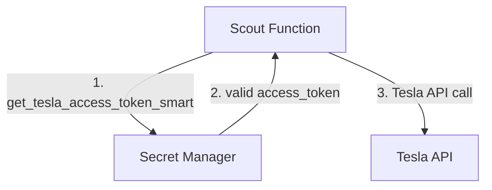
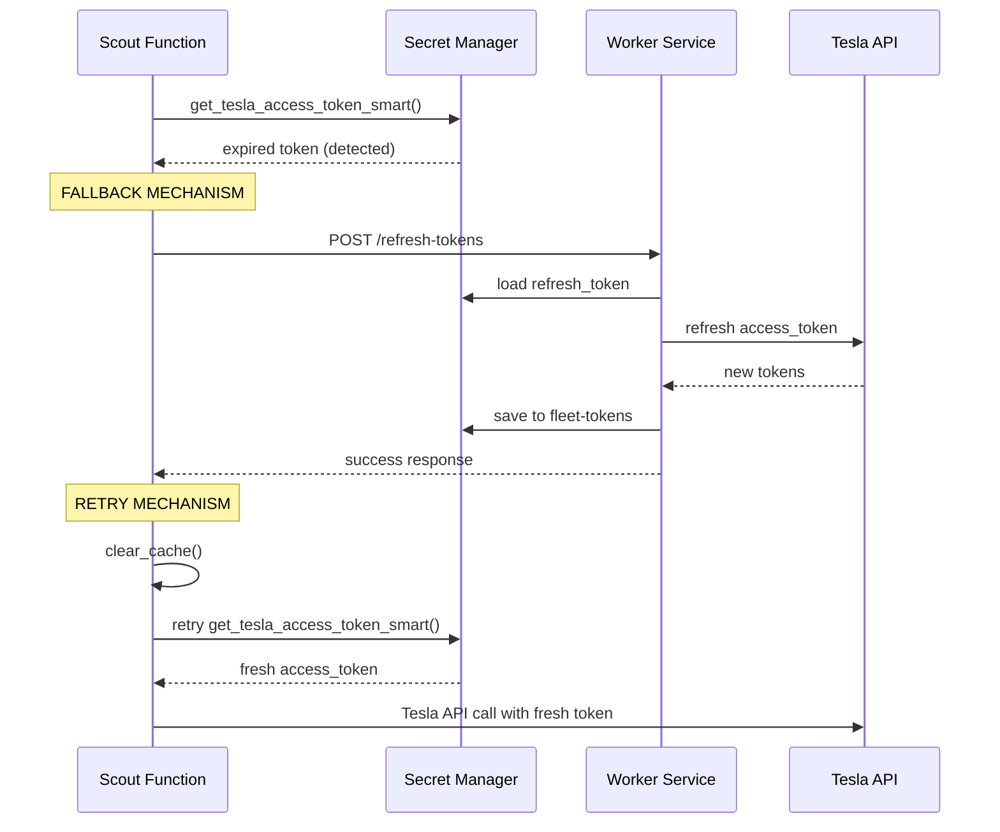

# 🔄 Scout & Worker: Architektura Hybrydowa v3.1

## 🎯 **ROZWIĄZANIE PROBLEMU Z ODŚWIEŻANIEM TOKENÓW**

### **Problem z poprzednią architekturą v3**:
- Scout miał bezpośredni dostęp do Secret Manager (fleet-tokens) ✅
- Worker miał logikę odświeżania tokenów ✅  
- **LUKA**: Gdy tokeny wygasły, Scout zwracał `None` bez akcji ❌
- **SKUTEK**: Błędy 401 Unauthorized trwały do ręcznego uruchomienia Worker ❌

### **Rozwiązanie - Architektura Hybrydowa v3.1**:
- **Normalna operacja**: Scout → Secret Manager (bezpośrednio)
- **Sytuacja awaryjna**: Scout → Worker → Secret Manager → Scout  
- **Automatyczne odświeżanie**: Gdy Scout wykryje wygasłe tokeny

---

## 🏗️ **ARCHITEKTURA PRZEPŁYWU**

### **Normalny przepływ (95% przypadków)**:


### **Przepływ awaryjny (5% przypadków - wygasłe tokeny)**:


---

## 🔧 **IMPLEMENTACJA - KOMPONENTY**

### **1. Scout Function - Wykrywanie wygasłych tokenów**
```python
# scout_function_deploy/main.py
def get_tesla_access_token_smart() -> Optional[str]:
    # ... sprawdź cache i Secret Manager
    
    if now >= buffer_time:  # Token wygasł
        logger.warning("⚠️ Token wygasł - wywołuję Worker do odświeżenia")
        
        # NOWY MECHANIZM: Fallback do Worker
        refresh_result = trigger_worker_refresh_tokens("Token wygasł")
        
        if refresh_result["success"]:
            # Pobierz świeże tokeny po odświeżeniu przez Worker
            fresh_token = retry_get_token_from_secret_manager()
            if fresh_token:
                return fresh_token
        
        return None  # Fallback failed
```

### **2. Scout Function - Wywołanie Worker**
```python
def trigger_worker_refresh_tokens(reason: str) -> Dict[str, Any]:
    # Rate limiting protection (endless loop)
    if _last_refresh_attempt and (now - _last_refresh_attempt).seconds < 60:
        return {"success": False, "message": "Rate limit"}
    
    # HTTP call do Worker
    response = requests.post(f"{WORKER_URL}/refresh-tokens", 
                           json=payload, timeout=45)
    
    return {"success": response.status_code == 200, ...}
```

### **3. Scout Function - Ponowne pobranie tokenów**  
```python
def retry_get_token_from_secret_manager() -> Optional[str]:
    # Wyczyść wszystkie cache
    _cached_access_token = None
    _token_expires_at = None
    _token_cache.clear_cache()
    
    # Pauza dla Worker żeby zapisał tokeny
    time.sleep(2)
    
    # Świeże pobranie z Secret Manager
    return get_tesla_access_token_smart()
```

### **4. Worker Service - Endpoint /refresh-tokens**
```python
# cloud_tesla_worker.py
def _handle_refresh_tokens(self):
    # Pobierz dane od Scout (reason, requester, attempt_count)
    
    # Wymuś pełne odświeżenie tokenów
    tokens_ensured = self.monitor._ensure_centralized_tokens()
    
    if tokens_ensured:
        response = {
            "status": "success",
            "message": "Tokeny odświeżone przez Worker", 
            "recommendation": "Scout can retry Secret Manager"
        }
        return 200, response
    else:
        return 500, {"status": "error", "error": "Cannot refresh tokens"}
```

---

## 🛡️ **MECHANIZMY OCHRONNE**

### **1. Rate Limiting (endless loop protection)**
```python
# Maksymalnie 1 próba odświeżenia na minutę
if _last_refresh_attempt and (now - _last_refresh_attempt).seconds < 60:
    return {"success": False, "message": "Rate limit"}
```

### **2. Timeout Protection**  
```python
# 45s timeout dla Worker (potrzebuje czasu na odświeżenie)
response = requests.post(..., timeout=45)
```

### **3. Connection Error Handling**
```python
try:
    response = requests.post(...)
except requests.exceptions.ConnectionError:
    return {"success": False, "error": "Worker unavailable"}
```

### **4. Cache Clearing** 
```python
def clear_cache(self):
    # Usuń plik cache żeby wymusić świeże pobranie
    if os.path.exists(self.cache_file):
        os.remove(self.cache_file)
```

---

## 📊 **KORZYŚCI ARCHITEKTURY v3.1**

### **✅ Zachowane z v3**:
- Niskie koszty (Scout głównie używa Secret Manager bezpośrednio)
- Wydajność (persistent cache w Scout)
- Skalowanie do zera (Worker wywoływany rzadko)

### **✅ Nowe w v3.1**:
- **Automatyczne odświeżanie**: Scout nie "stoi" gdy tokeny wygasną
- **Odporność na błędy**: Fallback mechanism dla wygasłych tokenów  
- **Rate limiting**: Ochrona przed endless loop
- **Szczegółowe logowanie**: Łatwiejsze debugowanie
- **Graceful degradation**: Jeśli Worker nie działa, Scout loguje błąd

---

## 🚀 **WDROŻENIE**

### **1. Aktualizacja Scout Function**
```bash
# Wdroż nową wersję Scout z mechanizmem fallback
gcloud functions deploy tesla-scout \
  --source=scout_function_deploy \
  --set-env-vars="WORKER_SERVICE_URL=https://your-worker-url"
```

### **2. Worker Service już gotowy**
```bash
# Worker już ma endpoint /refresh-tokens - nie wymaga zmian
# Sprawdź czy działa:
curl -X POST https://your-worker-url/refresh-tokens \
  -H "Content-Type: application/json" \
  -d '{"reason":"Test mechanizmu fallback"}'
```

### **3. Test mechanizmu**
```bash
# Uruchom test weryfikacyjny
python3 test_token_refresh_fallback.py

# Oczekiwany wynik:
# ✅ PASS Worker Endpoint
# ✅ PASS Scout Fallback  
# ✅ PASS Rate Limiting
# ✅ PASS Cache Clearing
# 🎉 WSZYSTKIE TESTY PRZESZŁY
```

---

## 🔍 **ROZWIĄZANIE KONKRETNEGO PROBLEMU**

### **Problem z logów (20:15)**:
```
⚠️ [SCOUT] Token in fleet-tokens expired or expiring in <5 min
💡 [SCOUT] Worker should automatically refresh tokens
ERROR: 401 Unauthorized (5 prób)
```

### **Rozwiązanie v3.1**:
```
⚠️ [SCOUT] Token in fleet-tokens expired or expiring in <5 min  
💡 [SCOUT] Próbuję odświeżyć tokeny przez Worker Service
🔄 [SCOUT] Wywołuję Worker do odświeżenia tokenów
✅ [SCOUT] Worker potwierdził odświeżenie - pobieram świeże tokeny
🔄 [SCOUT] Worker zakończył odświeżenie - pobieram świeże tokeny  
✅ [SCOUT] Pomyślnie pobrano świeże tokeny po odświeżeniu przez Worker
```

---

## 📋 **MONITORING I DIAGNOSTYKA**

### **Logowanie Scout**:
```
🔄 [SCOUT] Wykryto wygasłe tokeny - wywołuję Worker
📡 [SCOUT] Pobieram świeże tokeny z Secret Manager po odświeżeniu
✅ [SCOUT] Pomyślnie pobrano świeże tokeny po odświeżeniu przez Worker
```

### **Logowanie Worker**:
```
🔄 [WORKER] SCOUT_FUNCTION żąda wymuszenia odświeżenia tokenów Tesla
✅ [WORKER] Tokeny odświeżone pomyślnie w 1250ms
💡 [WORKER] Scout może teraz pobrać świeże tokeny z Secret Manager
```

### **Metryki do monitorowania**:
- Liczba wywołań fallback mechanism
- Czas wykonania odświeżania przez Worker
- Rate limiting events
- Cache hit ratio po odświeżeniu

---

## 🎯 **PODSUMOWANIE**

**Architektura v3.1** rozwiązuje kluczowy problem automatycznego odświeżania tokenów, zachowując wszystkie korzyści architektury v3:

- **Koszt**: Bez zmian (~20 groszy dziennie)
- **Wydajność**: Bez zmian (cache + Secret Manager)  
- **Odporność**: NOWA - automatyczne odświeżanie wygasłych tokenów
- **Monitoring**: ULEPSZONE - szczegółowe logowanie

**Rezultat**: Scout już nigdy nie będzie "stał" z błędami 401 gdy tokeny wygasną - automatycznie wywoła Worker do odświeżenia i pobierze świeże tokeny. 